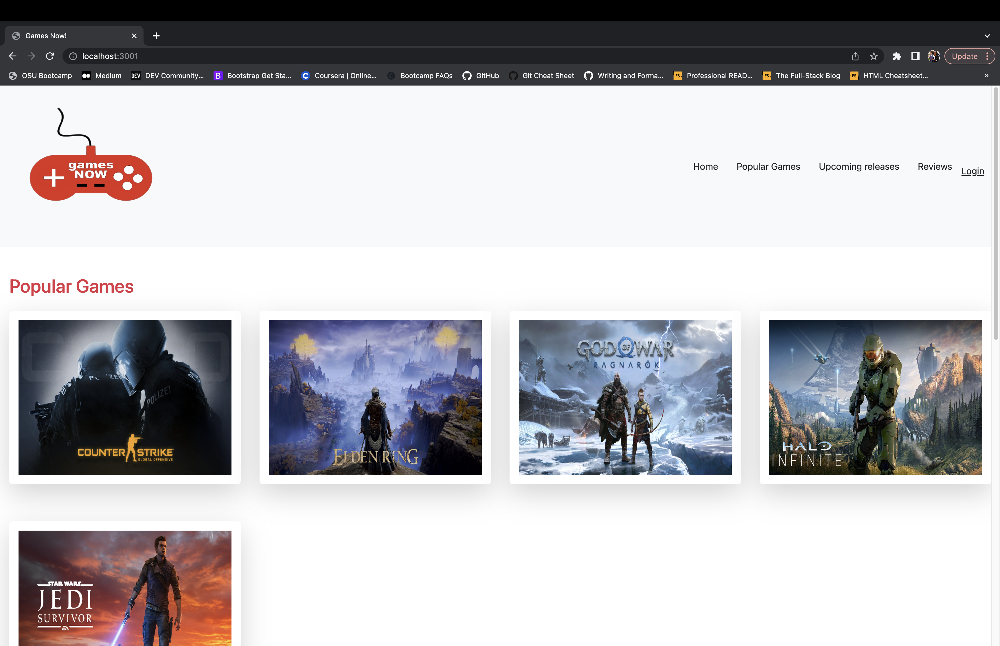

# Games Now!

## Description
This application was made for the gamer who likes to try new games. We wanted to give users the ability to view popular games and upcoming releases, as well as leave reviews. Users also have the ability to upvote or downvote a review.

## Table of Contents
- [Games Now!](#games-now)
  - [Description](#description)
  - [Table of Contents](#table-of-contents)
  - [Installation](#installation)
  - [Usage](#usage)
  - [Preview](#preview)
  - [Deployed Application](#deployed-application)
  - [Credits](#credits)
  - [License](#license)

## Installation

N/A

## Usage

From the homepage, you can view popular games and upcoming releases. When you click the game's image, you're able to leave a rating and see other ratings(if any). You're also able to view the game's description, genre, and platforms it's available on. 

## Preview

## Deployed Application

https://gamereviewsnow.herokuapp.com/

## Credits
Collaborators:  
[Mike Sima](https://github.com/ShadowBox23)  
[Joseph Flynn](https://github.com/Alphastranger)  
[Kayla Norris](https://github.com/KaylaNorris)   
[Nathan Dugue](https://github.com/NathanDugue)  

Special Thanks to TAs Conner Rhodes and Stephon Autery 

## License

  
Please refer to the LICENSE file in the repo.
